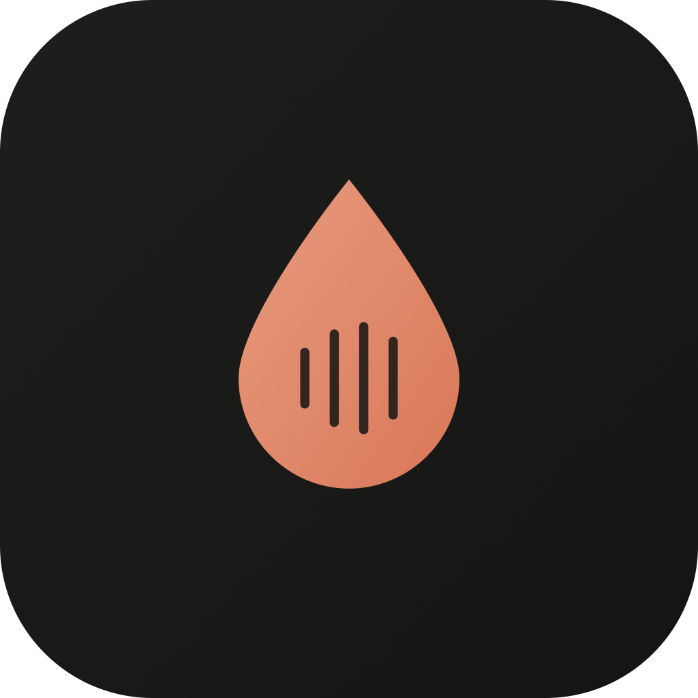

<div align="center">

<!-- TODO: replace with logo asset (droplet + audio ring mark, terracotta #d97757) -->


# Audistill

**Distill knowledge from every conversation.**

A local-first AI audio knowledge base for macOS. Turn podcasts, YouTube videos, meetings, and any audio into searchable summaries, notes, and a knowledge base you can chat with — without your audio ever leaving your Mac.

[](LICENSE)
[](#download)
[](https://github.com/OWNER/audistill/stargazers)

[Download](#download) · [Features](#features) · [How it works](#how-it-works) · [Build from source](#build-from-source) · [FAQ](#faq)

<!-- TODO: demo GIF here — 10–15s: drop in a YouTube link → transcript appears → summary → chat. This is the most important asset in this README. -->


</div>

> ⭐ **If Audistill looks useful to you, star the repo.** It's a one-person hobby project with no marketing budget — GitHub stars are literally the only way new people discover it.

## Why Audistill?

You listen to hours of podcasts, talks, and meetings — and forget most of it. Audistill ingests any audio or video source, transcribes it **on-device**, distills it into structured summaries, and builds a personal knowledge base you can search and chat with.

- **Private by design.** Speech-to-text runs 100% locally (NVIDIA Parakeet). Your audio never touches a server.
- **Your AI, your key.** Summaries and chat use your own [OpenRouter](https://openrouter.ai) key — pick any model, pay cents, no middleman markup.
- **No subscription.** One-time license, or build it from source for free. Forever.

## Features

- 🎙️ **Ingest anything** — audio files, video files, YouTube links, podcast episodes
- ⚡ **Local transcription** — NVIDIA Parakeet on-device speech-to-text, fast and offline
- 📝 **Distilled summaries** — structured takeaways, not a wall of transcript
- 🧪 **Recipes** — reusable distillation templates for different content types
- 💬 **Chat with your library** — ask questions across everything you've ever ingested
- 🗂️ **Knowledge base** — everything stored locally in SQLite, searchable, yours
- 🔑 **Bring your own key** — OpenRouter for summarization/chat; any model you like
- 🌗 **Native macOS feel** — light/dark, warm paper-inspired design

## Download

Audistill is open source (GPL v3) **and** a paid app. Both are intentional:

| | |
|---|---|
| 💾 **[Download Audistill — $29 one-time](https://TODO-polar-link)** | Notarized build, automatic updates, supports development. 1 year of updates included; the app keeps working forever. |
| 🛠️ **[Build from source](#build-from-source)** | Free, forever. You handle building and updating yourself. |

No subscription either way. If you build from source and end up liking it, buying a license (or starring the repo ⭐) is how you keep the project alive.

## How it works

1. **Add a source** — drag in a file or paste a YouTube/podcast URL
2. **Local transcription** — Parakeet converts speech to text entirely on your Mac
3. **Distill** — your chosen LLM (via your OpenRouter key) produces a structured summary
4. **Keep & chat** — everything lands in your local knowledge base, ready to search and query

The only data that leaves your machine is the transcript text sent to the LLM you chose, with your key, under your control. Want full offline? <!-- TODO: confirm/remove if local LLM support exists -->

## Build from source

```bash
git clone https://github.com/OWNER/audistill.git
cd audistill
pnpm install
pnpm build:mac
```

Requirements: macOS 13+, Node 20+, pnpm. The built app is unsigned — you'll need to allow it in System Settings → Privacy & Security.

## FAQ

**Is my audio uploaded anywhere?**
No. Transcription is fully local. Only the resulting text is sent to the LLM provider you configured, with your own API key.

**Why is it paid if it's open source?**
The $29 license buys convenience (signed build, auto-updates) and funds development. The source being open means you can verify the privacy claims, fix things yourself, and run it free if you want.

**What does summarization cost me?**
You pay OpenRouter directly — typically a few cents per hour of audio, depending on the model you pick.

**Windows/Linux?**
macOS only for now.

## Contributing

Issues and PRs welcome — bug reports with reproduction steps are the most valuable thing you can file. Fair warning: this is a spare-time hobby project, so responses are best-effort. See [CONTRIBUTING.md](CONTRIBUTING.md).

## License

[GPL v3](LICENSE). The Audistill name, logo, and icon are **not** covered by the license — forks must use their own branding.

---

<div align="center">

**Found this useful? [⭐ Star the repo](https://github.com/OWNER/audistill) — it genuinely helps more than you'd think.**

</div>
