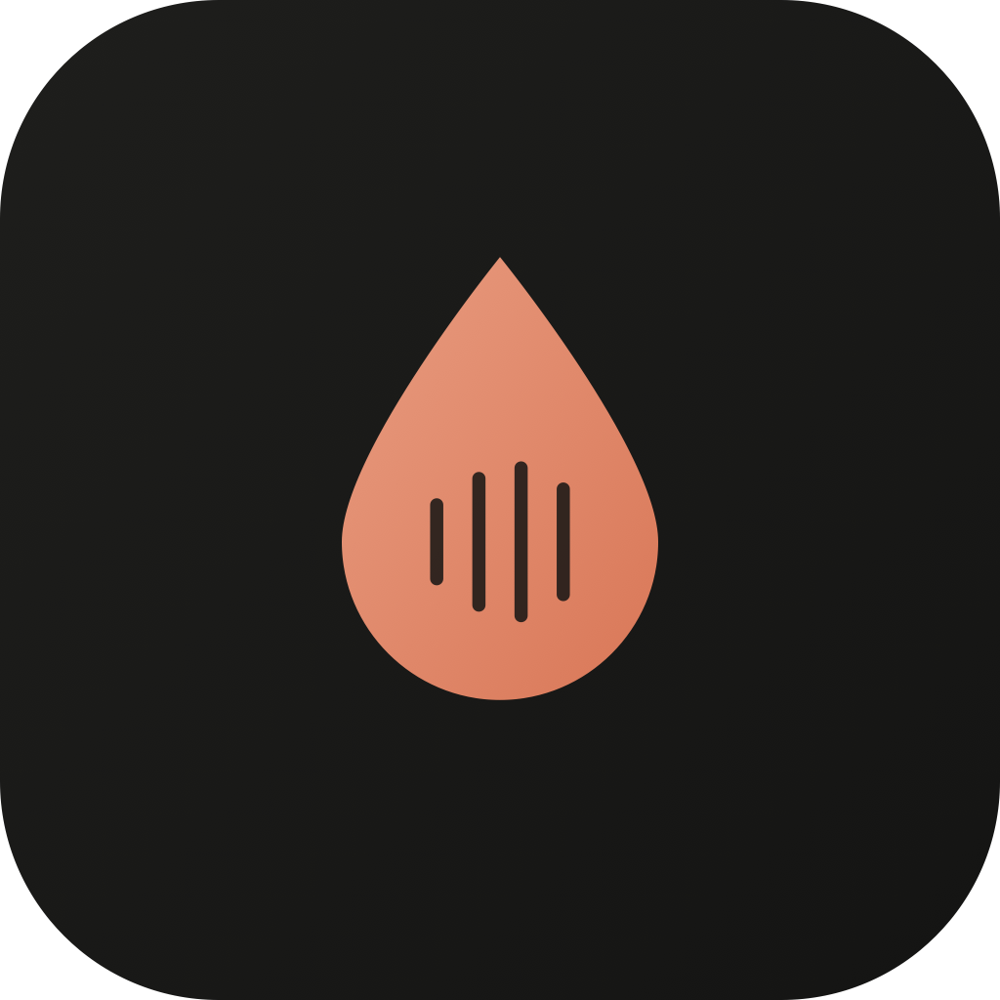
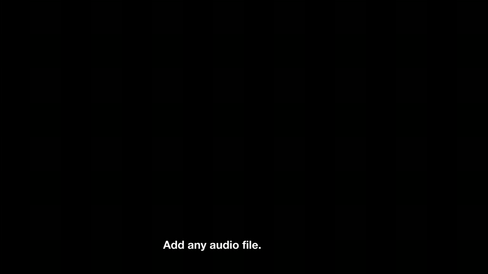

<div align="center">



# Audistill

**Distill knowledge from every conversation.**

A local-first AI audio knowledge base for macOS. Turn podcasts, YouTube videos, meetings, and any audio into searchable summaries, notes, and a knowledge base you can chat with — without your audio ever leaving your Mac.

[](LICENSE)
[](#download)
[](https://github.com/audistill/audistill/stargazers)

[Download](#download) · [Features](#features) · [How it works](#how-it-works) · [Build from source](#build-from-source) · [FAQ](#faq)



</div>

> ⭐ **If Audistill looks useful to you, star the repo.** It's a one-person hobby project with no marketing budget — GitHub stars are literally the only way new people discover it.

## Why Audistill?

You listen to hours of podcasts, talks, and meetings — and forget most of it. Audistill ingests any audio or video source, transcribes it **on-device**, distills it into structured summaries, and builds a personal knowledge base you can search and chat with.

- **Private by design.** Speech-to-text runs 100% locally (NVIDIA Parakeet). Your audio never touches a server.
- **Your AI, your key.** Summaries and chat use your own [OpenRouter](https://openrouter.ai) key — pick any model, pay cents, no middleman markup.
- **Free and open source.** No subscription, no license key, no trial. Optional donations only.

## Features

- 🎙️ **Ingest anything** — audio files, video files, YouTube links, podcast episodes
- ⚡ **Local transcription** — NVIDIA Parakeet on-device speech-to-text, fast and offline
- 📝 **Distilled summaries** — structured takeaways, not a wall of transcript
- 🧪 **Recipes** — reusable distillation templates for different content types
- 💬 **Chat with your library** — ask questions across everything you've ever ingested
- 🗂️ **Knowledge base** — everything stored locally in SQLite, searchable, yours
- 🔑 **Bring your own key** — OpenRouter for summarization/chat; any model you like
- 🌗 **Native macOS feel** — light/dark, warm paper-inspired design

## Download

Audistill is free and open source (AGPL-3.0). Download the signed macOS build, or build it from source. No payment, registration, or license key is needed.

| | |
|---|---|
| 💾 **[Download Audistill](https://audistill.com/)** | Signed, notarized build with automatic updates. |
| 🛠️ **[Build from source](#build-from-source)** | You handle building and updating yourself. |

If you like Audistill, you can [optionally buy me a coffee](https://buymeacoffee.com/gaborkh). Donations unlock nothing and carry no support commitment.

## How it works

1. **Add a source** — drag in a file or paste a YouTube/podcast URL
2. **Local transcription** — Parakeet converts speech to text entirely on your Mac
3. **Distill** — your chosen LLM (via your OpenRouter key) produces a structured summary
4. **Keep & chat** — everything lands in your local knowledge base, ready to search and query

The only data that leaves your machine is the transcript text sent to the LLM you chose, with your key, under your control. There's no fully-offline mode: Audistill deliberately doesn't bundle a local LLM, because on-device models aren't good enough at distillation yet and the hardware requirements would rule out too many Macs. Transcription, storage, and search stay local regardless.

## Build from source

```bash
git clone https://github.com/audistill/audistill.git
cd audistill
pnpm install
pnpm dev          # run in development mode
pnpm build:mac    # build a .dmg for yourself
```

Requirements: macOS 13+, Node 20+, pnpm.

The built app is unsigned — you'll need to allow it in System Settings → Privacy & Security.

## FAQ

**Is my audio uploaded anywhere?**
No. Transcription is fully local. Only the resulting text is sent to the LLM provider you configured, with your own API key.

**Is it really free?**
Yes. There is no trial, license, or activation. Donations are optional and unlock nothing.

**What does summarization cost me?**
You bring your own OpenRouter API key and pay OpenRouter directly for Model usage — typically a few cents per hour of audio, depending on the model you pick.

**Windows/Linux?**
macOS only for now.

## Contributing

Issues and PRs are welcome — bug reports with reproduction steps are the most valuable thing you can file.

One thing to know first: day-to-day development happens in a private repository, and this public repo is a source snapshot that receives one squashed commit per release. So `main` here is rewritten on every release, and a pull request can't be merged directly — it would be overwritten by the next snapshot. Accepted PRs get ported into the private tree by hand, ship in the next release, and are credited in the release notes. Small, focused changes land much more easily than large ones; for anything substantial, open an issue first.

Fair warning: this is a spare-time hobby project, so responses are best-effort. See [CONTRIBUTING.md](CONTRIBUTING.md).

## License

[AGPL-3.0](LICENSE). The Audistill name, logo, and icon are **not** covered by the license — forks must use their own branding.

---

<div align="center">

**Found this useful? [⭐ Star the repo](https://github.com/audistill/audistill) — it genuinely helps more than you'd think.**

</div>
